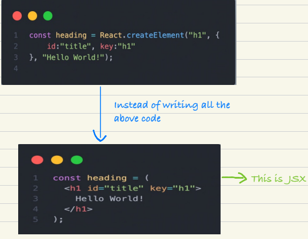
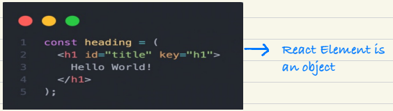
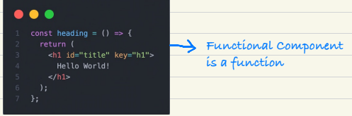
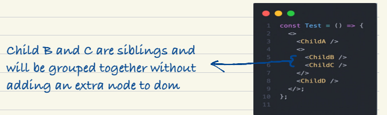

# CLASS 2

## * createElement: 
    - React.createElement() is creating an object. 
    - This object is converted into HTML code and puts it upon DOM. - If you want to build a big HTML structure, then using  createElement() is not a good Solution. 
    - So there comes introduction of JSX 
# * JavaScript XML ( JSX): 
    - When Facebook created React, the major concept behind  bringing react was that we want to write a lot of HTML using  javascript, because JS is very performant. 

    - JSX is not ‘HTML inside JavaScript’
    - JSX has ‘HTML like syntax‘
    - React keeps track of keys

    - Our browser cannot understand JSX. Babel understands this
    code.
    - JSX uses React.createElement() behind the scenes.

    JSX => React.createElement() => object =>HTML DOM

    - Babel converts JSX to React.createElement()
    - JSX is created to empower React.

### * Advantages of JSX:
    - Developer Experience
    - Syntactical Sugar
    - Readibilty
    - Less code
    - Maintainability
    - No Repitition

    ** Babel comes along with VITE **

# * Components:
    - Everything is a component in React.
# * React Components:
    There are 2 types of components
    Functional Components - NEW way
`   Class Based Components - OLD way

### * Functional Components:
    - is nothing but a JavaScript function.
    - is a normal JS function which returns some piece of react
    elements (here, JSX)

    - For any component, Name starts with capital letter. (It is not
      mandatory but it’s a convention)
    - To render functional component write <HeaderComponent />

   **React Element:**
   

   **Functional Component:**
   

   #### Important points:
    - Whenever you write jsx, you can write any piece of javascript
    code between Paranthesis {}. It will work.
    - JSX is very secure.
    - JSX makes sure your app is safe.
    - It does samitization.

    #### * Component Composition:
    - If I have to use a component inside a component. Then it is called
    component composition / composing components.
    3 ways of component composition:
    - {Title()}
    - <Title /> (used generally)
    - <Title></Title>

    **Note:**
    JSX expressions must have one parent element.

# CLASS 3

## * React Fragment:
    - It is a component which is exported by ‘React’.
    [ import React from “react” ]
    - Groups list of children without adding extra nodes to the DOM.
    - Shorthand syntax <> </> is used generally instead of
    <React.Fragment> </React.Fragment>
    - But, you cannot pass styles to empty brackets.

## Styling inside React:
    - Using Javascript Object.
    - giving class name to the respective tag and write the css
    inside .css file.
    - using external libraries like ‘Tailwind CSS’, ‘Bootstrap’,
    ‘Material UI’, etc.

## Q . Can I use ‘React.Fragment ’ inside my ‘React.Fragment’?
    Yes  

**Note:**
    In real world, data coming from api comes as “Array of Objects”

### * Optional Chaining:
    - Allows us to access an object’s properties without having to check
    if the object or its properties exist.
    - represented by ? operator.
    - Introduced in JavaScript ES 2020.

    **Example:**
    restaurantList[0].data?.name
### * Props:
    - shorthand for properties
    - When we say "pass props," we mean we're transferring data or
    specific features into our React components. Just like passing
    information to a friend, we're sending data to our components to
    define their behavior and characteristics.
    - resData = {restaurantList[0]}
    This means react wraps up all these properties into a variable
    known as ‘props’. We can call it anything.
#### * Object Destructuring:
    - It unpacks specific properties from an object into individual
    variables, streamlining data access and making code cleaner.

#### * Spread Operator (...):
    - It unpacks iterables like arrays and objects, spreading their
    elements wherever it's used.
    Example:
    - Combine arrays: [...a, ...b] joins a and b.
    - Add elements: [...a, "new"] puts "new" at the start of a.
    - Pass function arguments: func(...a) expands a as individual
    args.

# CLASS 4

## * Virtual DOM:
    - The Virtual DOM is React's secret weapon! Imagine it as a
    lightweight, in-memory snapshot of your webpage's UI.
    - When changes happen, React updates this snapshot first, then
    efficiently figures out the minimal edits needed to bring the real
    DOM in sync.
    - We need Virtual DOM for Reconciliation.

## * Reconciliation:
    - It takes the updated Virtual DOM and figures out the most
    efficient way to bring the real DOM in line.
    - It uses Diff Algorithm and it determines what needs to change
    and what does not in UI.
    - To find out difference between one tree (Actual DOM) and other
    (Virtual DOM).
    - Diff Algorithm then finds out what needs to be updated and it
    change only that small portion.

## * React Fiber:
    - React Fiber is a complete rewrite of React's internal reconciliation
    engine, built for speed and flexibility.
    - It is responsible for Diff Algorithm.
    - So, Reconciliation is the "what" of updating the DOM, while React
    Fiber is the "how" it's done in a more efficient and flexible way.

### * React File Structure:
    - React itself doesn't dictate a specific file structure, but common
    best practices help keep your code organized and maintainable.

### * Export:
    - There are 2 types of exports commonly used:

    **1. Named Export:**
    - Exports multiple values with custom names, imported with
    specific names
    (e.g., `export const add = (a, b) => a + b;
    import { add } from "./math";`).

    **2. Default Export:**
    - Exports only one value, imported with name
    (e.g., ` Hello=()=> { ... };
    export default Hello;
    import Hello from "./greetings";`).

## * React Variable:
    - It is like a state variable

   **“Every component in React maintains a state. So, you can put
    some variables on to that state”**

    - Everytime, you have to create a local variable, you can use state
    in it.
    - In react, if I want to create a local variable like ‘searchText’, I will create it using useState Hook.

## * Hooks:
    - Hooks are normal functions.
    - React Hooks are like tools you can "hook into" React features
    without needing a class component.
    - Hooks bring the power of classes to function components,
    making your React code simpler and more flexible.

    

    <!-- 
    
    import React, { useState } from "react";
import AccordionItem from "./AccordionItem";

const faqs = [
  { question: "What is your return policy?", answer: "You can return within 30 days." },
  { question: "Do you ship internationally?", answer: "Yes, we ship worldwide!" },
  { question: "How can I track my order?", answer: "Tracking link will be emailed to you." },
];

const AccordionWrapper = () => {
  const [openIndex, setOpenIndex] = useState(null);

  const handleClick = (index) => {
    setOpenIndex((prev) => (prev === index ? null : index)); // toggle
  };

  return (
    

      <h2>FAQs</h2>
      {faqs.map((faq, index) => (
        <AccordionItem
          key={index}
          question={faq.question}
          answer={faq.answer}
          isOpen={openIndex === index}
          onClick={() => handleClick(index)}
        />
      ))}
    

  );
};

export default AccordionWrapper;

    
     -->